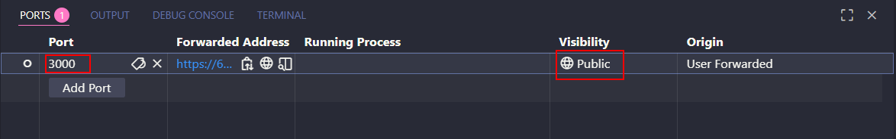

# 🚀 Webhook GitHub → Slack

¡Conecta tus repositorios de GitHub con tus canales de Slack y mantén a tu equipo siempre informado!  
Este proyecto es una demo que te permite recibir notificaciones automáticas en Slack cada vez que ocurre un evento push de GitHub.

---

## 📦 Getting Started

1. **Clona el repositorio:**
   ```bash
   git clone https://github.com/Lemoncode/webhook-github-slack.git
   ```
2. **Instala dependencias:**
   ```bash
   npm install
   ```
3. **Configura tus webhooks:**
   - [Tu repositorio Github > Settings > Webhooks](https://github.com/Lemoncode/webhook-github-slack/settings/hooks)

   - [Tu aplicación Slack > Incoming Webhooks](https://api.slack.com/apps)

4. **Arranca el servidor:**
   ```bash
   npm start
   ```

5. **Prueba el webhook:**
   - Realiza un nuevo commit y push para ver las notificaciones en tu canal de Slack.

---

## 🖼️ Publicación del puerto

Si lo ejecutas desde localhost, puedes publicar el puerto usando VSCode:



---
